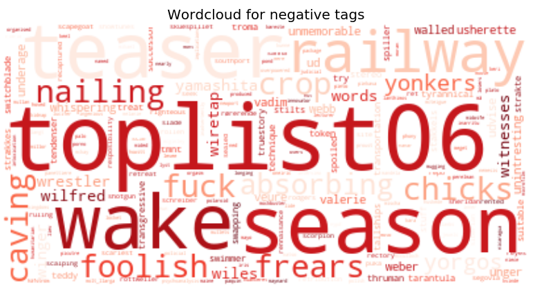

<html>
<body>

</body>
</html>

<html>
<body>

</body>
</html>

## Movie Recommendation for Social Graphs

The data used is from GroupLens and can be downloaded [here](https://grouplens.org/datasets/movielens/latest/). Here two different dataset can be found; The smallest dataset consist of the following three used files; movies.csv consists all the movies used, ratings.csv consists of all ratings given by users for the different movies, and tags.csv consists of tags a user have given to the movies. In total that gives around 9,000 movies, 100,000 ratings, 3,600 tags and 600 users. The largest dataset have the same three csv files, but with around 58,000 movies, 27,000,000 ratings, 1,100,000 tags and 280,000 users.

To get more information about the data and how the webpage is created see the [explainer notebook](https://nbviewer.jupyter.org). **(Put the explainer notebook up here)**  

## Sentiment analysis

### Sentiment for plot description
All the movies was divided into genres. All movies have a plot, where the sentiment for the plot is found. The distribution of plot sentiments can be seen by choosing the corresponding button.  

<button class="button" onclick="document.getElementById('sentiment_plot').src='images/plot_sentiment_(no genres listed).png'">no genres</button>
<button class="button" onclick="document.getElementById('sentiment_plot').src='images/plot_sentiment_Action.png'">Action</button>
<button class="button" onclick="document.getElementById('sentiment_plot').src='images/plot_sentiment_Adventure.png'">Adventure</button>
<button class="button" onclick="document.getElementById('sentiment_plot').src='images/plot_sentiment_Animation.png'">Animation</button>
<button class="button" onclick="document.getElementById('sentiment_plot').src='images/plot_sentiment_Children.png'">Children</button>
<button class="button" onclick="document.getElementById('sentiment_plot').src='images/plot_sentiment_Comedy.png'">Comedy</button>
<button class="button" onclick="document.getElementById('sentiment_plot').src='images/plot_sentiment_Crime.png'">Crime</button>
<button class="button" onclick="document.getElementById('sentiment_plot').src='images/plot_sentiment_Documentary.png'">Documentary</button>
<button class="button" onclick="document.getElementById('sentiment_plot').src='images/plot_sentiment_Drama.png'">Drama</button>
<button class="button" onclick="document.getElementById('sentiment_plot').src='images/plot_sentiment_Fantasy.png'">Fantasy</button>
<button class="button" onclick="document.getElementById('sentiment_plot').src='images/plot_sentiment_Film-Noir.png'">Film-Noir</button>
<button class="button" onclick="document.getElementById('sentiment_plot').src='images/plot_sentiment_Horror.png'">Horror</button>
<button class="button" onclick="document.getElementById('sentiment_plot').src='images/plot_sentiment_IMAX.png'">IMAX</button>
<button class="button" onclick="document.getElementById('sentiment_plot').src='images/plot_sentiment_Musical.png'">Musical</button>
<button class="button" onclick="document.getElementById('sentiment_plot').src='images/plot_sentiment_Mystery.png'">Mystery</button>
<button class="button" onclick="document.getElementById('sentiment_plot').src='images/plot_sentiment_Romance.png'">Romance</button>
<button class="button" onclick="document.getElementById('sentiment_plot').src='images/plot_sentiment_Sci-Fi.png'">Sci-Fi</button>
<button class="button" onclick="document.getElementById('sentiment_plot').src='images/plot_sentiment_Thriller.png'">Thriller</button>
<button class="button" onclick="document.getElementById('sentiment_plot').src='images/plot_sentiment_War.png'">War</button>
<button class="button" onclick="document.getElementById('sentiment_plot').src='images/plot_sentiment_Western.png'">Western</button>

### Sentiment for tags

<button class="button" onclick="document.getElementById('sentiment_tag').src='images/tag_sentiment_(no genres listed).png'">no genres</button>
<button class="button" onclick="document.getElementById('sentiment_tag').src='images/tag_sentiment_Action.png'">Action</button>
<button class="button" onclick="document.getElementById('sentiment_tag').src='images/tag_sentiment_Adventure.png'">Adventure</button>
<button class="button" onclick="document.getElementById('sentiment_tag').src='images/tag_sentiment_Animation.png'">Animation</button>
<button class="button" onclick="document.getElementById('sentiment_tag').src='images/tag_sentiment_Children.png'">Children</button>
<button class="button" onclick="document.getElementById('sentiment_tag').src='images/tag_sentiment_Comedy.png'">Comedy</button>
<button class="button" onclick="document.getElementById('sentiment_tag').src='images/tag_sentiment_Crime.png'">Crime</button>
<button class="button" onclick="document.getElementById('sentiment_tag').src='images/tag_sentiment_Documentary.png'">Documentary</button>
<button class="button" onclick="document.getElementById('sentiment_tag').src='images/tag_sentiment_Drama.png'">Drama</button>
<button class="button" onclick="document.getElementById('sentiment_tag').src='images/tag_sentiment_Fantasy.png'">Fantasy</button>
<button class="button" onclick="document.getElementById('sentiment_tag').src='images/tag_sentiment_Film-Noir.png'">Film-Noir</button>
<button class="button" onclick="document.getElementById('sentiment_tag').src='images/tag_sentiment_Horror.png'">Horror</button>
<button class="button" onclick="document.getElementById('sentiment_tag').src='images/tag_sentiment_IMAX.png'">IMAX</button>
<button class="button" onclick="document.getElementById('sentiment_tag').src='images/tag_sentiment_Musical.png'">Musical</button>
<button class="button" onclick="document.getElementById('sentiment_tag').src='images/tag_sentiment_Mystery.png'">Mystery</button>
<button class="button" onclick="document.getElementById('sentiment_tag').src='images/tag_sentiment_Romance.png'">Romance</button>
<button class="button" onclick="document.getElementById('sentiment_tag').src='images/tag_sentiment_Sci-Fi.png'">Sci-Fi</button>
<button class="button" onclick="document.getElementById('sentiment_tag').src='images/tag_sentiment_Thriller.png'">Thriller</button>
<button class="button" onclick="document.getElementById('sentiment_tag').src='images/tag_sentiment_War.png'">War</button>
<button class="button" onclick="document.getElementById('sentiment_tag').src='images/tag_sentiment_Western.png'">Western</button>

## Wordclouds

### Visualization of plot description

<button class="button" onclick="document.getElementById('wordcloud_plot').src='images/plot_wordcloud_(no genres listed).png'">no genres</button>
<button class="button" onclick="document.getElementById('wordcloud_plot').src='images/plot_wordcloud_Action.png'">Action</button>
<button class="button" onclick="document.getElementById('wordcloud_plot').src='images/plot_wordcloud_Adventure.png'">Adventure</button>
<button class="button" onclick="document.getElementById('wordcloud_plot').src='images/plot_wordcloud_Animation.png'">Animation</button>
<button class="button" onclick="document.getElementById('wordcloud_plot').src='images/plot_wordcloud_Children.png'">Children</button>
<button class="button" onclick="document.getElementById('wordcloud_plot').src='images/plot_wordcloud_Comedy.png'">Comedy</button>
<button class="button" onclick="document.getElementById('wordcloud_plot').src='images/plot_wordcloud_Crime.png'">Crime</button>
<button class="button" onclick="document.getElementById('wordcloud_plot').src='images/plot_wordcloud_Documentary.png'">Documentary</button>
<button class="button" onclick="document.getElementById('wordcloud_plot').src='images/plot_wordcloud_Drama.png'">Drama</button>
<button class="button" onclick="document.getElementById('wordcloud_plot').src='images/plot_wordcloud_Fantasy.png'">Fantasy</button>
<button class="button" onclick="document.getElementById('wordcloud_plot').src='images/plot_wordcloud_Film-Noir.png'">Film-Noir</button>
<button class="button" onclick="document.getElementById('wordcloud_plot').src='images/plot_wordcloud_Horror.png'">Horror</button>
<button class="button" onclick="document.getElementById('wordcloud_plot').src='images/plot_wordcloud_IMAX.png'">IMAX</button>
<button class="button" onclick="document.getElementById('wordcloud_plot').src='images/plot_wordcloud_Musical.png'">Musical</button>
<button class="button" onclick="document.getElementById('wordcloud_plot').src='images/plot_wordcloud_Mystery.png'">Mystery</button>
<button class="button" onclick="document.getElementById('wordcloud_plot').src='images/plot_wordcloud_Romance.png'">Romance</button>
<button class="button" onclick="document.getElementById('wordcloud_plot').src='images/plot_wordcloud_Sci-Fi.png'">Sci-Fi</button>
<button class="button" onclick="document.getElementById('wordcloud_plot').src='images/plot_wordcloud_Thriller.png'">Thriller</button>
<button class="button" onclick="document.getElementById('wordcloud_plot').src='images/plot_wordcloud_War.png'">War</button>
<button class="button" onclick="document.getElementById('wordcloud_plot').src='images/plot_wordcloud_Western.png'">Western</button>

### Visualization of tags

<button class="button" onclick="document.getElementById('wordcloud_tag').src='images/tag_wordcloud_(no genres listed).png'">no genres</button>
<button class="button" onclick="document.getElementById('wordcloud_tag').src='images/tag_wordcloud_Action.png'">Action</button>
<button class="button" onclick="document.getElementById('wordcloud_tag').src='images/tag_wordcloud_Adventure.png'">Adventure</button>
<button class="button" onclick="document.getElementById('wordcloud_tag').src='images/tag_wordcloud_Animation.png'">Animation</button>
<button class="button" onclick="document.getElementById('wordcloud_tag').src='images/tag_wordcloud_Children.png'">Children</button>
<button class="button" onclick="document.getElementById('wordcloud_tag').src='images/tag_wordcloud_Comedy.png'">Comedy</button>
<button class="button" onclick="document.getElementById('wordcloud_tag').src='images/tag_wordcloud_Crime.png'">Crime</button>
<button class="button" onclick="document.getElementById('wordcloud_tag').src='images/tag_wordcloud_Documentary.png'">Documentary</button>
<button class="button" onclick="document.getElementById('wordcloud_tag').src='images/tag_wordcloud_Drama.png'">Drama</button>
<button class="button" onclick="document.getElementById('wordcloud_tag').src='images/tag_wordcloud_Fantasy.png'">Fantasy</button>
<button class="button" onclick="document.getElementById('wordcloud_tag').src='images/tag_wordcloud_Film-Noir.png'">Film-Noir</button>
<button class="button" onclick="document.getElementById('wordcloud_tag').src='images/tag_wordcloud_Horror.png'">Horror</button>
<button class="button" onclick="document.getElementById('wordcloud_tag').src='images/tag_wordcloud_IMAX.png'">IMAX</button>
<button class="button" onclick="document.getElementById('wordcloud_tag').src='images/tag_wordcloud_Musical.png'">Musical</button>
<button class="button" onclick="document.getElementById('wordcloud_tag').src='images/tag_wordcloud_Mystery.png'">Mystery</button>
<button class="button" onclick="document.getElementById('wordcloud_tag').src='images/tag_wordcloud_Romance.png'">Romance</button>
<button class="button" onclick="document.getElementById('wordcloud_tag').src='images/tag_wordcloud_Sci-Fi.png'">Sci-Fi</button>
<button class="button" onclick="document.getElementById('wordcloud_tag').src='images/tag_wordcloud_Thriller.png'">Thriller</button>
<button class="button" onclick="document.getElementById('wordcloud_tag').src='images/tag_wordcloud_War.png'">War</button>
<button class="button" onclick="document.getElementById('wordcloud_tag').src='images/tag_wordcloud_Western.png'">Western</button>

