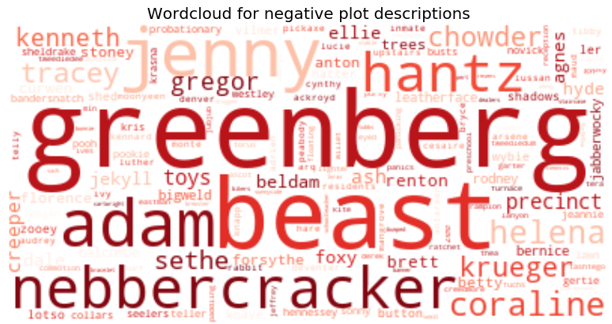

<html>
<body>

</body>
</html>

<html>
<body>

</body>
</html>

<html>
<body>

</body>
</html>

## Movie Recommendation for Social Graphs

### Data description

The data used is from GroupLens and can be downloaded [here](https://grouplens.org/datasets/movielens/latest/). Here two different dataset can be found; The smallest dataset consist of the following three used files; movies.csv consists of all the movies used, ratings.csv consists of all the ratings given by users for the different movies, and tags.csv consisting of tags a user have given to the movies. In total that gives around 9,000 movies, 100,000 ratings, 3,600 tags and 600 users. The largest dataset have the same three csv files, but with around 58,000 movies, 27,000,000 ratings, 1,100,000 tags and 280,000 users.
Another dataset used is from Kaggle and can be downloaded [here](https://www.kaggle.com/jrobischon/wikipedia-movie-plots/data). This dataset consists of 35,000 movies where the plot description for each movie have been scraped from Wikipedia.

To get more information about the data and how the webpage is created see the [explainer notebook](https://nbviewer.jupyter.org). **(Put the explainer notebook up here)**  

## Social graph

## Community detection

## Sentiment analysis

The sentiment of a text gives a happiness score for one or more words. The scale is from 1 - the least happy to 9 - the most happy. A happiness score of 5 is neutral. In this way it is possible to see whether a word or text is negative or positive.

By using the sentiment an analysis is made based on the plot description for a movie and the tags given by users. By doing this the overall sentiment for a genre is found in both cases. This will show if the plot description and tags given by users agrees with each other.

### Sentiment for plot description
First of all the sentiment for the plot description is looked at. The large dataset from GroupLens was combined with the dataset from Kaggle. In this way the subset of movies was found such that a new dataset with around 14,000 movies were created with a corresponding plot description.
Afterwards all the movies was divided into genres. For each genre the sentiment for the movies in each genre was found. The distribution of plot sentiments can be seen by choosing the corresponding button for one of the 20 unique genres in the dataset.  

<button class="button" onclick="document.getElementById('sentiment_plot').src='images/plot_sentiment_(no genres listed).png'">no genres</button>
<button class="button" onclick="document.getElementById('sentiment_plot').src='images/plot_sentiment_Action.png'">Action</button>
<button class="button" onclick="document.getElementById('sentiment_plot').src='images/plot_sentiment_Adventure.png'">Adventure</button>
<button class="button" onclick="document.getElementById('sentiment_plot').src='images/plot_sentiment_Animation.png'">Animation</button>
<button class="button" onclick="document.getElementById('sentiment_plot').src='images/plot_sentiment_Children.png'">Children</button>
<button class="button" onclick="document.getElementById('sentiment_plot').src='images/plot_sentiment_Comedy.png'">Comedy</button>
<button class="button" onclick="document.getElementById('sentiment_plot').src='images/plot_sentiment_Crime.png'">Crime</button>
<button class="button" onclick="document.getElementById('sentiment_plot').src='images/plot_sentiment_Documentary.png'">Documentary</button>
<button class="button" onclick="document.getElementById('sentiment_plot').src='images/plot_sentiment_Drama.png'">Drama</button>
<button class="button" onclick="document.getElementById('sentiment_plot').src='images/plot_sentiment_Fantasy.png'">Fantasy</button>
<button class="button" onclick="document.getElementById('sentiment_plot').src='images/plot_sentiment_Film-Noir.png'">Film-Noir</button>
<button class="button" onclick="document.getElementById('sentiment_plot').src='images/plot_sentiment_Horror.png'">Horror</button>
<button class="button" onclick="document.getElementById('sentiment_plot').src='images/plot_sentiment_IMAX.png'">IMAX</button>
<button class="button" onclick="document.getElementById('sentiment_plot').src='images/plot_sentiment_Musical.png'">Musical</button>
<button class="button" onclick="document.getElementById('sentiment_plot').src='images/plot_sentiment_Mystery.png'">Mystery</button>
<button class="button" onclick="document.getElementById('sentiment_plot').src='images/plot_sentiment_Romance.png'">Romance</button>
<button class="button" onclick="document.getElementById('sentiment_plot').src='images/plot_sentiment_Sci-Fi.png'">Sci-Fi</button>
<button class="button" onclick="document.getElementById('sentiment_plot').src='images/plot_sentiment_Thriller.png'">Thriller</button>
<button class="button" onclick="document.getElementById('sentiment_plot').src='images/plot_sentiment_War.png'">War</button>
<button class="button" onclick="document.getElementById('sentiment_plot').src='images/plot_sentiment_Western.png'">Western</button>

When looking at the sentiment distribution for each genre, it can be seen how all the sentiments are distributed around the neutral 5 with a low spreading. This means that the plot descriptions in general are very neutral and does not bias a movie into being negative or positive.

Even though there are no clear negative or positive plots, the movies in each genre have been divided into negative and positive movies. The negative movies are therefore categorized as all movies in the genre with a sentiment lower than the mean - 2 times the standard deviation, and the positive movies are categorized as all movies with a sentiment higher than the mean + 2 times the standard deviation. This will be visualized later, to see if there is a tendency in the movies, even though the sentiment for the plot descriptions are neutral.

Next step therefore is to look at the sentiment for tags, and see if the tags have more to say about the sentiment about the genres.

### Sentiment for tags

In same manner as for the plot description, the tags were divided into each genre. This gave the following distributions for the different genres.

<button class="button" onclick="document.getElementById('sentiment_tag').src='images/tag_sentiment_(no genres listed).png'">no genres</button>
<button class="button" onclick="document.getElementById('sentiment_tag').src='images/tag_sentiment_Action.png'">Action</button>
<button class="button" onclick="document.getElementById('sentiment_tag').src='images/tag_sentiment_Adventure.png'">Adventure</button>
<button class="button" onclick="document.getElementById('sentiment_tag').src='images/tag_sentiment_Animation.png'">Animation</button>
<button class="button" onclick="document.getElementById('sentiment_tag').src='images/tag_sentiment_Children.png'">Children</button>
<button class="button" onclick="document.getElementById('sentiment_tag').src='images/tag_sentiment_Comedy.png'">Comedy</button>
<button class="button" onclick="document.getElementById('sentiment_tag').src='images/tag_sentiment_Crime.png'">Crime</button>
<button class="button" onclick="document.getElementById('sentiment_tag').src='images/tag_sentiment_Documentary.png'">Documentary</button>
<button class="button" onclick="document.getElementById('sentiment_tag').src='images/tag_sentiment_Drama.png'">Drama</button>
<button class="button" onclick="document.getElementById('sentiment_tag').src='images/tag_sentiment_Fantasy.png'">Fantasy</button>
<button class="button" onclick="document.getElementById('sentiment_tag').src='images/tag_sentiment_Film-Noir.png'">Film-Noir</button>
<button class="button" onclick="document.getElementById('sentiment_tag').src='images/tag_sentiment_Horror.png'">Horror</button>
<button class="button" onclick="document.getElementById('sentiment_tag').src='images/tag_sentiment_IMAX.png'">IMAX</button>
<button class="button" onclick="document.getElementById('sentiment_tag').src='images/tag_sentiment_Musical.png'">Musical</button>
<button class="button" onclick="document.getElementById('sentiment_tag').src='images/tag_sentiment_Mystery.png'">Mystery</button>
<button class="button" onclick="document.getElementById('sentiment_tag').src='images/tag_sentiment_Romance.png'">Romance</button>
<button class="button" onclick="document.getElementById('sentiment_tag').src='images/tag_sentiment_Sci-Fi.png'">Sci-Fi</button>
<button class="button" onclick="document.getElementById('sentiment_tag').src='images/tag_sentiment_Thriller.png'">Thriller</button>
<button class="button" onclick="document.getElementById('sentiment_tag').src='images/tag_sentiment_War.png'">War</button>
<button class="button" onclick="document.getElementById('sentiment_tag').src='images/tag_sentiment_Western.png'">Western</button>

Again it can be seen how the sentiment is distributed around the neutral 5, though with a slightly higher spreading. This is a bit surprising, since it would be easy to think that a user tag would be more prone into being negative or positive. The reason for these results could be because of the tags only being a few words, making the sentiment of the tags more general.

As for the plot descriptions, the tags have been divided into negative and positive tags in each genre, which will be visualized in the next step to see if there is a tendency in the tags, and to see if negative plot descriptions will agree with negative tags and vice versa.

Next step therefore is to visualize these results, and see if the plot description and the tags also uses the same words when describing the genre, both in general but also when considering negative and positive plot descriptions and tags. This is done by the use of wordclouds.

## Wordclouds

The wordclouds picture all the most important words of a subset by the use of TF-IDF. By using the wordclouds for each genre it therefore shows which words are the most used or are most important for that genre, divided into plot description and tags.

### Visualization of plot description

First the plot description will be visualized by the wordclouds. Each genre consisting of all the corresponding plot description is one part of the full corpus. The full corpus therefore consists of all genres with plot descriptions. The wordclouds for each genre can be seen by clicking the corresponding button for the wanted genre.

<button class="button" onclick="document.getElementById('wordcloud_plot').src='images/plot_wordcloud_(no genres listed).png'">no genres</button>
<button class="button" onclick="document.getElementById('wordcloud_plot').src='images/plot_wordcloud_Action.png'">Action</button>
<button class="button" onclick="document.getElementById('wordcloud_plot').src='images/plot_wordcloud_Adventure.png'">Adventure</button>
<button class="button" onclick="document.getElementById('wordcloud_plot').src='images/plot_wordcloud_Animation.png'">Animation</button>
<button class="button" onclick="document.getElementById('wordcloud_plot').src='images/plot_wordcloud_Children.png'">Children</button>
<button class="button" onclick="document.getElementById('wordcloud_plot').src='images/plot_wordcloud_Comedy.png'">Comedy</button>
<button class="button" onclick="document.getElementById('wordcloud_plot').src='images/plot_wordcloud_Crime.png'">Crime</button>
<button class="button" onclick="document.getElementById('wordcloud_plot').src='images/plot_wordcloud_Documentary.png'">Documentary</button>
<button class="button" onclick="document.getElementById('wordcloud_plot').src='images/plot_wordcloud_Drama.png'">Drama</button>
<button class="button" onclick="document.getElementById('wordcloud_plot').src='images/plot_wordcloud_Fantasy.png'">Fantasy</button>
<button class="button" onclick="document.getElementById('wordcloud_plot').src='images/plot_wordcloud_Film-Noir.png'">Film-Noir</button>
<button class="button" onclick="document.getElementById('wordcloud_plot').src='images/plot_wordcloud_Horror.png'">Horror</button>
<button class="button" onclick="document.getElementById('wordcloud_plot').src='images/plot_wordcloud_IMAX.png'">IMAX</button>
<button class="button" onclick="document.getElementById('wordcloud_plot').src='images/plot_wordcloud_Musical.png'">Musical</button>
<button class="button" onclick="document.getElementById('wordcloud_plot').src='images/plot_wordcloud_Mystery.png'">Mystery</button>
<button class="button" onclick="document.getElementById('wordcloud_plot').src='images/plot_wordcloud_Romance.png'">Romance</button>
<button class="button" onclick="document.getElementById('wordcloud_plot').src='images/plot_wordcloud_Sci-Fi.png'">Sci-Fi</button>
<button class="button" onclick="document.getElementById('wordcloud_plot').src='images/plot_wordcloud_Thriller.png'">Thriller</button>
<button class="button" onclick="document.getElementById('wordcloud_plot').src='images/plot_wordcloud_War.png'">War</button>
<button class="button" onclick="document.getElementById('wordcloud_plot').src='images/plot_wordcloud_Western.png'">Western</button>

Overall it can be seen how the words in the wordclouds are as expected. For a genre as Children, words as "rabbit", "princess" and "pinocchio" comes up, whereas a genre as Horror, have words as "zombie", "monster" and "vampire".

The tags will now be visualized to see if it is possible to compare these results with the ones for the plot description.

### Visualization of tags

The full corpus this time is all the tags for the different genre. One part of the corpus therefore is all tags for one genre. The results for this visualization can be seen by clicking on the corresponding buttons below.

<button class="button" onclick="document.getElementById('wordcloud_tag').src='images/tag_wordcloud_(no genres listed).png'">no genres</button>
<button class="button" onclick="document.getElementById('wordcloud_tag').src='images/tag_wordcloud_Action.png'">Action</button>
<button class="button" onclick="document.getElementById('wordcloud_tag').src='images/tag_wordcloud_Adventure.png'">Adventure</button>
<button class="button" onclick="document.getElementById('wordcloud_tag').src='images/tag_wordcloud_Animation.png'">Animation</button>
<button class="button" onclick="document.getElementById('wordcloud_tag').src='images/tag_wordcloud_Children.png'">Children</button>
<button class="button" onclick="document.getElementById('wordcloud_tag').src='images/tag_wordcloud_Comedy.png'">Comedy</button>
<button class="button" onclick="document.getElementById('wordcloud_tag').src='images/tag_wordcloud_Crime.png'">Crime</button>
<button class="button" onclick="document.getElementById('wordcloud_tag').src='images/tag_wordcloud_Documentary.png'">Documentary</button>
<button class="button" onclick="document.getElementById('wordcloud_tag').src='images/tag_wordcloud_Drama.png'">Drama</button>
<button class="button" onclick="document.getElementById('wordcloud_tag').src='images/tag_wordcloud_Fantasy.png'">Fantasy</button>
<button class="button" onclick="document.getElementById('wordcloud_tag').src='images/tag_wordcloud_Film-Noir.png'">Film-Noir</button>
<button class="button" onclick="document.getElementById('wordcloud_tag').src='images/tag_wordcloud_Horror.png'">Horror</button>
<button class="button" onclick="document.getElementById('wordcloud_tag').src='images/tag_wordcloud_IMAX.png'">IMAX</button>
<button class="button" onclick="document.getElementById('wordcloud_tag').src='images/tag_wordcloud_Musical.png'">Musical</button>
<button class="button" onclick="document.getElementById('wordcloud_tag').src='images/tag_wordcloud_Mystery.png'">Mystery</button>
<button class="button" onclick="document.getElementById('wordcloud_tag').src='images/tag_wordcloud_Romance.png'">Romance</button>
<button class="button" onclick="document.getElementById('wordcloud_tag').src='images/tag_wordcloud_Sci-Fi.png'">Sci-Fi</button>
<button class="button" onclick="document.getElementById('wordcloud_tag').src='images/tag_wordcloud_Thriller.png'">Thriller</button>
<button class="button" onclick="document.getElementById('wordcloud_tag').src='images/tag_wordcloud_War.png'">War</button>
<button class="button" onclick="document.getElementById('wordcloud_tag').src='images/tag_wordcloud_Western.png'">Western</button>

Looking at the genre Children, words as "pixar", "animals" and "cartoon" comes up. Looking at Horror "zombie", "alien" and "twist" are words that can be seen. When comparing these words to the ones for the plot descriptions, it is clear that for each genre they have the same overall sense. It seems that the plot description uses more specific words, whereas the tags uses more general words.

Next the negative and positive plot descriptions and tags will now be visualized to see if they can be compared as well.

## Negative and positive visualization

A visualization of the negative plot descriptions compared to the negative tags have been visualized. Afterwards the positive plot descriptions compared to the positive tags can be seen.

<button class="button1" onclick="document.getElementById('neg').src='images/neg_plot.png'">Plots</button>
<button class="button1" onclick="document.getElementById('neg').src='images/neg_tag.png'">Tags</button>

<button class="button1" onclick="document.getElementById('pos').src='images/pos_plot.png'">Plots</button>
<button class="button1" onclick="document.getElementById('pos').src='images/pos_tag.png'">Tags</button>

When looking at the individual wordclouds, it is not clear to see that one is negative movies and one is positive movies. A few words does make sense, for example for the negative movies words as "beast" and "fuck" can be seen. But other than a few words, the words in each cloud seems random. Comparing the plot description with the tags does not show any resemblance either. Of course this is due to the sentiment mean being around the neutral 5, and the standard deviation of these sentiments being very small.

Therefore it can be concluded that based on the Wikipedia plot descriptions and the tags given in the GroupLens dataset, it is not possible to define negative or positive movies or genres.
On the other hand the wordclouds based on the plot descriptions and the tags, can give an overview of what to expect from a genre, and therefore help with finding a movie based on the feelings one get from this.
