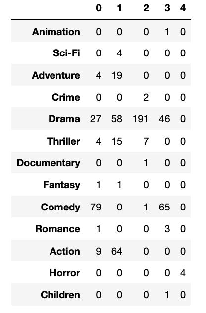
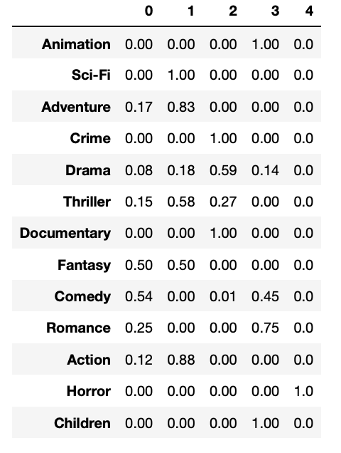
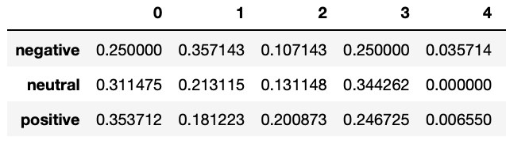

<html>
<body>

</body>
</html>

## Movie Recommendation for Social Graphs

### Data description

The data used is from GroupLens and can be downloaded [here](https://grouplens.org/datasets/movielens/latest/). Here two different dataset can be found; The smallest dataset consist of the following three used files; movies.csv which consists of all the movies used, ratings.csv which consists of all the ratings given by users for the different movies, and tags.csv consisting of tags a user have given to a movies. In total that yields around 9,000 movies, 100,000 ratings, 3,600 tags and 600 users. The larger dataset have the same three .csv files, but with around 58,000 movies, 27,000,000 ratings, 1,100,000 tags and 280,000 users.
Another dataset used is from Kaggle and can be downloaded [here](https://www.kaggle.com/jrobischon/wikipedia-movie-plots/data). This dataset consists of 35,000 movies where the plot description for each movie have been scraped from Wikipedia.

To get more information about the data and how the webpage is created see the [explainer notebook](https://github.com/michelle95n/MovieRecommendation/blob/master/Explainer_Notebook.ipynb). We had to link to the GitHub path for the notebook, since nbviewer, time after time, gave an error. 

By using this data, the goal is to create an overview of user behavior regarding movies, and get a feeling of the sentiment and important content for the genres given in the data.

## Social graph

A social graph gives a nice overview of some of the initial tendecencies there might be in the social data. By looking at and analysing a social graph, different aspects can be explored, such as setting the size and colours of the nodes to different measures to see if some patterns arises. Furthermore, the node influences can be explored by computing centrality measures. Lastly, community detection will tell if there are some meaningful partitions/communities in the graph as well.

The social graph in this project consists of nodes corresponding to users and edges corresponding to two users being similar. The way the similarity is measured is by the Pearson Correlation Coefficient, which is the slope of the linear regression line fitted to the two users' data. The range for the correlation is -1 to 1, where 1 is completely similar, and -1 completely opposite. Two users in the graph gets an edge between them if their correlation is above some threshold. The threshold is prefferred to lie close to 1, but if it is too close to 1 there might not be as many edges as one would like. Therefore the threshold were set by an iteratively process where a reasonable amount of edges were included in the graph. 

The correlation is made based on two users' user-profiles. A user-profile is, shortly, how much a user likes certain features occurring in certain content, which in this case is genres occurring in movies. The measure of "liking" are based on the user ratings.

Below is two ways to visualize the social graph. The first button 'Average rating' shows the social graph where the node sizes represents a user's average rating and the node colours represents a user's favorite genre taken from the sorted user-profile. The second button shows the same social graph with the node colours as before, but now the size is created by the Eigenvector centrality.

<button class="button1" onclick="document.getElementById('graph').src='images/graph_rating_colour_genre.png'">Average rating</button>
<button class="button1" onclick="document.getElementById('graph').src='images/graph_eigenvector_colour_genre.png'">Eigenvector centrality</button>

First of all when looking at the 'Average rating' graph, it can be seen that it seems as if the nodes are clustered into genre groups, where 'drama' and 'comedy' dominates and are the most seperated. Furthermore, we see that other popular genres are 'adventure', 'action' and 'thriller', but those are more intertwined. 

When looking at the graph where the node sizes are a Eigenvector Centrality score, a pattern can be seen. The Eigenvector Centrality score is a measure of how influential a node is, if a node is connected to many other nodes, which themselves have a high score, then that node also get a high score. I.e. the score depends on number of connections and the connected nodes score. Having this in mind, it can be observed that the genres 'drama' and 'comedy' generally gets the higher scores, i.e. 'drama' and 'comedy' nodes are generally more connected and influential in the graph. 

## Community detection

Community detection is for exploring whether or not there are some communities formed in the graph. By 'communities' is meant a partition, i.e. the graph is partitioned into a number of different groups. In this project the Louvain partition algorithm were used to find the 'best' partitioning. The Louvain algorithm (tries to) maximize the modularity of a partitioning. The partitioning in this case gets a modularity of 0.48 which is relatively good. 

Looking at the partitions in the graph it is not quite clear which factor contributes to this specific partitioning of the nodes. In order to explore which factor might have influence over the partitioning one can compute the confusion matrix, where the rows corresponds to levels of the factor and columns corresponds to the partitions. 

### Community detection by genres

First off the factor genre is explored. Below two tables can be seen; the first being the amount of nodes with a given genre belonging to a given partition, the second is the same table but every row value is divided by its row sum. The latter is done to see the where the different proportions of all nodes in a genre are distributed.

It can be seen from the above tables that 'Comedy' dominates in partition '0'. In partition '1' it seems as though 'drama' and 'action' have approximately the same number of nodes in this partition. However when looking at the table to the right it can be observed that 'action' have 88% of its nodes in partition '1', whereas 'drama' only have 18% of its nodes in this partition. It can be seen that 'drama' clearly dominates partition '2'. It is hard to conclude much about partition '3' but partition '4' consists exclusively of 'horror' nodes.

So, what this means is that genre may be a valid source for how the graph is partitioned, but generally the genres are still mixed a bit across partitions. One should also have in mind that this analysis is based on relatively few observations, which may affect the results.

### Community detection by ratings

To explore another factor, 'rating' were chosen, to see if the users' rating habits were to seperate them into partitions.
This were done by computing a weighted average for each user and then, given the weighted average, divide users into three intervals; 'negative', 'neutral' and 'positive'. 

From the above table it can be seen that rating does not contribute to the partitioning. Every interval has nodes spread across the different partitions and none of them really dominates anything.

## Sentiment analysis

The sentiment of a text gives a happiness score for one or more words. The scale is from 1; the least happy, to 9; the most happy, and 5 being neutral. In this way it is possible to see whether a word or text is negative or positive.

By using the sentiment, an analysis is made based on the plot description for a movie and the tags given by users. By doing this the overall sentiment for a genre is found in both cases. This will show if some genres are more negative or positive than others, and also if the plot description and tags given by users agrees with each other.

### Sentiment for plot description
First of all the sentiment for the plot description is looked at. The large dataset from GroupLens was combined with the dataset from Kaggle. In this way the subset of movies was found such that a new dataset with around 14,000 movies were created with a corresponding plot description.
Afterwards all the movies was divided into genres. For each genre the sentiment for the movies in each genre was found. The distribution of plot sentiments can be seen by choosing the corresponding button for one of the 20 unique genres in the dataset.  

<button class="button" onclick="document.getElementById('sentiment_plot').src='images/plot_sentiment_(no genres listed).png'">no genres</button>
<button class="button" onclick="document.getElementById('sentiment_plot').src='images/plot_sentiment_Action.png'">Action</button>
<button class="button" onclick="document.getElementById('sentiment_plot').src='images/plot_sentiment_Adventure.png'">Adventure</button>
<button class="button" onclick="document.getElementById('sentiment_plot').src='images/plot_sentiment_Animation.png'">Animation</button>
<button class="button" onclick="document.getElementById('sentiment_plot').src='images/plot_sentiment_Children.png'">Children</button>
<button class="button" onclick="document.getElementById('sentiment_plot').src='images/plot_sentiment_Comedy.png'">Comedy</button>
<button class="button" onclick="document.getElementById('sentiment_plot').src='images/plot_sentiment_Crime.png'">Crime</button>
<button class="button" onclick="document.getElementById('sentiment_plot').src='images/plot_sentiment_Documentary.png'">Documentary</button>
<button class="button" onclick="document.getElementById('sentiment_plot').src='images/plot_sentiment_Drama.png'">Drama</button>
<button class="button" onclick="document.getElementById('sentiment_plot').src='images/plot_sentiment_Fantasy.png'">Fantasy</button>
<button class="button" onclick="document.getElementById('sentiment_plot').src='images/plot_sentiment_Film-Noir.png'">Film-Noir</button>
<button class="button" onclick="document.getElementById('sentiment_plot').src='images/plot_sentiment_Horror.png'">Horror</button>
<button class="button" onclick="document.getElementById('sentiment_plot').src='images/plot_sentiment_IMAX.png'">IMAX</button>
<button class="button" onclick="document.getElementById('sentiment_plot').src='images/plot_sentiment_Musical.png'">Musical</button>
<button class="button" onclick="document.getElementById('sentiment_plot').src='images/plot_sentiment_Mystery.png'">Mystery</button>
<button class="button" onclick="document.getElementById('sentiment_plot').src='images/plot_sentiment_Romance.png'">Romance</button>
<button class="button" onclick="document.getElementById('sentiment_plot').src='images/plot_sentiment_Sci-Fi.png'">Sci-Fi</button>
<button class="button" onclick="document.getElementById('sentiment_plot').src='images/plot_sentiment_Thriller.png'">Thriller</button>
<button class="button" onclick="document.getElementById('sentiment_plot').src='images/plot_sentiment_War.png'">War</button>
<button class="button" onclick="document.getElementById('sentiment_plot').src='images/plot_sentiment_Western.png'">Western</button>

When looking at the sentiment distribution for each genre, it can be seen how all the sentiments are distributed around the neutral 5, with a low spreading of the sentiments. This means that the plot descriptions in general are fairly neutral, and does not bias a movie into being negative or positive. This makes sense such that when reading a plot description on Wikipedia, one does not get biased into having a certain belief about Wikipedia.

Even though there are no clear negative or positive plots, the movies in each genre have been divided into negative and positive movies. The negative movies are therefore categorized as all movies in the genre with a sentiment lower than the mean - 2 times the standard deviation, and the positive movies are categorized as all movies with a sentiment higher than the mean + 2 times the standard deviation. This will be visualized later, to see if there is a tendency in the movies, even though the sentiment for the plot descriptions are neutral.

Next step therefore is to look at the sentiment for tags, and see if the tags have more to say about the sentiment about the genres.

### Sentiment for tags

In same manner as for the plot description, the tags were divided into each genre. This gave the following distributions for the different genres.

<button class="button" onclick="document.getElementById('sentiment_tag').src='images/tag_sentiment_(no genres listed).png'">no genres</button>
<button class="button" onclick="document.getElementById('sentiment_tag').src='images/tag_sentiment_Action.png'">Action</button>
<button class="button" onclick="document.getElementById('sentiment_tag').src='images/tag_sentiment_Adventure.png'">Adventure</button>
<button class="button" onclick="document.getElementById('sentiment_tag').src='images/tag_sentiment_Animation.png'">Animation</button>
<button class="button" onclick="document.getElementById('sentiment_tag').src='images/tag_sentiment_Children.png'">Children</button>
<button class="button" onclick="document.getElementById('sentiment_tag').src='images/tag_sentiment_Comedy.png'">Comedy</button>
<button class="button" onclick="document.getElementById('sentiment_tag').src='images/tag_sentiment_Crime.png'">Crime</button>
<button class="button" onclick="document.getElementById('sentiment_tag').src='images/tag_sentiment_Documentary.png'">Documentary</button>
<button class="button" onclick="document.getElementById('sentiment_tag').src='images/tag_sentiment_Drama.png'">Drama</button>
<button class="button" onclick="document.getElementById('sentiment_tag').src='images/tag_sentiment_Fantasy.png'">Fantasy</button>
<button class="button" onclick="document.getElementById('sentiment_tag').src='images/tag_sentiment_Film-Noir.png'">Film-Noir</button>
<button class="button" onclick="document.getElementById('sentiment_tag').src='images/tag_sentiment_Horror.png'">Horror</button>
<button class="button" onclick="document.getElementById('sentiment_tag').src='images/tag_sentiment_IMAX.png'">IMAX</button>
<button class="button" onclick="document.getElementById('sentiment_tag').src='images/tag_sentiment_Musical.png'">Musical</button>
<button class="button" onclick="document.getElementById('sentiment_tag').src='images/tag_sentiment_Mystery.png'">Mystery</button>
<button class="button" onclick="document.getElementById('sentiment_tag').src='images/tag_sentiment_Romance.png'">Romance</button>
<button class="button" onclick="document.getElementById('sentiment_tag').src='images/tag_sentiment_Sci-Fi.png'">Sci-Fi</button>
<button class="button" onclick="document.getElementById('sentiment_tag').src='images/tag_sentiment_Thriller.png'">Thriller</button>
<button class="button" onclick="document.getElementById('sentiment_tag').src='images/tag_sentiment_War.png'">War</button>
<button class="button" onclick="document.getElementById('sentiment_tag').src='images/tag_sentiment_Western.png'">Western</button>

Again it can be seen how the sentiment is distributed around the neutral 5, though with a slightly higher spreading. This is a bit surprising, since it would be easy to think that a user tag would be more prone into being negative or positive. The reason for these results could be because of the tags only being a few words, making the sentiment of the tags more general.

As for the plot descriptions, the tags have been divided into negative and positive tags in each genre, which will be visualized in the next step to see if there is a tendency in the tags, and to see if negative plot descriptions will agree with negative tags and vice versa.

Next step therefore is to visualize these results, and see if the plot description and the tags also uses the same words when describing the genre, both in general but also when considering negative and positive plot descriptions and tags. This is done by the use of wordclouds.

## Wordclouds

The wordclouds picture all the most important words of a subset by the use of TF-IDF. By using the wordclouds for each genre it therefore shows which words are the most used or are most important for that genre, divided into plot description and tags.

### Visualization of plot description

First the plot description will be visualized by the wordclouds. Each genre consisting of all the corresponding plot description is one part of the full corpus. The full corpus therefore consists of all genres with plot descriptions. The wordclouds for each genre can be seen by clicking the corresponding button for the wanted genre.

<button class="button" onclick="document.getElementById('wordcloud_plot').src='images/plot_wordcloud_(no genres listed).png'">no genres</button>
<button class="button" onclick="document.getElementById('wordcloud_plot').src='images/plot_wordcloud_Action.png'">Action</button>
<button class="button" onclick="document.getElementById('wordcloud_plot').src='images/plot_wordcloud_Adventure.png'">Adventure</button>
<button class="button" onclick="document.getElementById('wordcloud_plot').src='images/plot_wordcloud_Animation.png'">Animation</button>
<button class="button" onclick="document.getElementById('wordcloud_plot').src='images/plot_wordcloud_Children.png'">Children</button>
<button class="button" onclick="document.getElementById('wordcloud_plot').src='images/plot_wordcloud_Comedy.png'">Comedy</button>
<button class="button" onclick="document.getElementById('wordcloud_plot').src='images/plot_wordcloud_Crime.png'">Crime</button>
<button class="button" onclick="document.getElementById('wordcloud_plot').src='images/plot_wordcloud_Documentary.png'">Documentary</button>
<button class="button" onclick="document.getElementById('wordcloud_plot').src='images/plot_wordcloud_Drama.png'">Drama</button>
<button class="button" onclick="document.getElementById('wordcloud_plot').src='images/plot_wordcloud_Fantasy.png'">Fantasy</button>
<button class="button" onclick="document.getElementById('wordcloud_plot').src='images/plot_wordcloud_Film-Noir.png'">Film-Noir</button>
<button class="button" onclick="document.getElementById('wordcloud_plot').src='images/plot_wordcloud_Horror.png'">Horror</button>
<button class="button" onclick="document.getElementById('wordcloud_plot').src='images/plot_wordcloud_IMAX.png'">IMAX</button>
<button class="button" onclick="document.getElementById('wordcloud_plot').src='images/plot_wordcloud_Musical.png'">Musical</button>
<button class="button" onclick="document.getElementById('wordcloud_plot').src='images/plot_wordcloud_Mystery.png'">Mystery</button>
<button class="button" onclick="document.getElementById('wordcloud_plot').src='images/plot_wordcloud_Romance.png'">Romance</button>
<button class="button" onclick="document.getElementById('wordcloud_plot').src='images/plot_wordcloud_Sci-Fi.png'">Sci-Fi</button>
<button class="button" onclick="document.getElementById('wordcloud_plot').src='images/plot_wordcloud_Thriller.png'">Thriller</button>
<button class="button" onclick="document.getElementById('wordcloud_plot').src='images/plot_wordcloud_War.png'">War</button>
<button class="button" onclick="document.getElementById('wordcloud_plot').src='images/plot_wordcloud_Western.png'">Western</button>

Overall it can be seen how the words in the wordclouds are as expected. For a genre as Children, words as "rabbit", "princess" and "pinocchio" comes up, whereas a genre as Horror, have words as "zombie", "monster" and "vampire".

The tags will now be visualized to see if it is possible to compare these results with the ones for the plot description.

### Visualization of tags

The full corpus this time is all the tags for the different genre. One part of the corpus therefore is all tags for one genre. The results for this visualization can be seen by clicking on the corresponding buttons below.

<button class="button" onclick="document.getElementById('wordcloud_tag').src='images/tag_wordcloud_(no genres listed).png'">no genres</button>
<button class="button" onclick="document.getElementById('wordcloud_tag').src='images/tag_wordcloud_Action.png'">Action</button>
<button class="button" onclick="document.getElementById('wordcloud_tag').src='images/tag_wordcloud_Adventure.png'">Adventure</button>
<button class="button" onclick="document.getElementById('wordcloud_tag').src='images/tag_wordcloud_Animation.png'">Animation</button>
<button class="button" onclick="document.getElementById('wordcloud_tag').src='images/tag_wordcloud_Children.png'">Children</button>
<button class="button" onclick="document.getElementById('wordcloud_tag').src='images/tag_wordcloud_Comedy.png'">Comedy</button>
<button class="button" onclick="document.getElementById('wordcloud_tag').src='images/tag_wordcloud_Crime.png'">Crime</button>
<button class="button" onclick="document.getElementById('wordcloud_tag').src='images/tag_wordcloud_Documentary.png'">Documentary</button>
<button class="button" onclick="document.getElementById('wordcloud_tag').src='images/tag_wordcloud_Drama.png'">Drama</button>
<button class="button" onclick="document.getElementById('wordcloud_tag').src='images/tag_wordcloud_Fantasy.png'">Fantasy</button>
<button class="button" onclick="document.getElementById('wordcloud_tag').src='images/tag_wordcloud_Film-Noir.png'">Film-Noir</button>
<button class="button" onclick="document.getElementById('wordcloud_tag').src='images/tag_wordcloud_Horror.png'">Horror</button>
<button class="button" onclick="document.getElementById('wordcloud_tag').src='images/tag_wordcloud_IMAX.png'">IMAX</button>
<button class="button" onclick="document.getElementById('wordcloud_tag').src='images/tag_wordcloud_Musical.png'">Musical</button>
<button class="button" onclick="document.getElementById('wordcloud_tag').src='images/tag_wordcloud_Mystery.png'">Mystery</button>
<button class="button" onclick="document.getElementById('wordcloud_tag').src='images/tag_wordcloud_Romance.png'">Romance</button>
<button class="button" onclick="document.getElementById('wordcloud_tag').src='images/tag_wordcloud_Sci-Fi.png'">Sci-Fi</button>
<button class="button" onclick="document.getElementById('wordcloud_tag').src='images/tag_wordcloud_Thriller.png'">Thriller</button>
<button class="button" onclick="document.getElementById('wordcloud_tag').src='images/tag_wordcloud_War.png'">War</button>
<button class="button" onclick="document.getElementById('wordcloud_tag').src='images/tag_wordcloud_Western.png'">Western</button>

Looking at the genre Children, words as "pixar", "animals" and "cartoon" comes up. Looking at Horror "zombie", "alien" and "twist" are words that can be seen. When comparing these words to the ones for the plot descriptions, it is clear that for each genre they have the same overall sense. It seems that the plot description uses more specific words, whereas the tags uses more general words. This can give an idea about what to expect of movies in a given genre and therefore if some genres are more compelling.

Next the negative and positive plot descriptions and tags will now be visualized to see if they can be compared as well.

## Negative and positive visualization

A visualization of the negative plot descriptions compared to the negative tags have been visualized. Afterwards the positive plot descriptions compared to the positive tags can be seen.

<button class="button1" onclick="document.getElementById('neg').src='images/neg_plot.png'">Plots</button>
<button class="button1" onclick="document.getElementById('neg').src='images/neg_tag.png'">Tags</button>

<button class="button1" onclick="document.getElementById('pos').src='images/pos_plot.png'">Plots</button>
<button class="button1" onclick="document.getElementById('pos').src='images/pos_tag.png'">Tags</button>

When looking at the individual wordclouds, it is not clear to see that one is negative movies and one is positive movies. A few words does make sense, for example for the negative movies words as "beast" and "fuck" can be seen. But other than a few words, the words in each cloud seems random. Comparing the plot description with the tags does not show any resemblance either. Of course this is due to the sentiment mean being around the neutral 5, and the standard deviation of these sentiments being very small.

Therefore it can be concluded that based on the Wikipedia plot descriptions and the tags given in the GroupLens dataset, it is not possible to define negative or positive movies or genres.
On the other hand, the wordclouds based on the plot descriptions and the tags, can give an overview of what to expect from movies in a genre, and therefore help with finding a movie based on the feelings one get from this.
